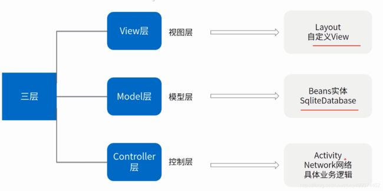

# 微博客

## 架构
采用前端分离架构:
+ api:  后端接口服务
    + Go开发的Restful接口, Web框架采用Gin
    + 数据存储: MySQL(SQL+ORM)
+ web:  vue3的前端
    + 前端框架:vue3, vue-router
    + UI组件: arcoUI(头条2021-12开源的vue3UI组件库)

## 设计

省略了需求的收集

### 功能设计

管理员:
+ 文章上传接口: 标题, 标签, 内容(图片看情况，需不需要图床, OSS)

浏览者:
+ 文章的列表接口: 获取所有的上传的文章列表(标签和标题已经元数据), 支持分页, 支持按照Tag过滤
+ 文章的详情接口: 核心获取文章的内容, 前端展示出来(markdown展示工具)

### 用户角色

+ 管理员
+ 博客浏览人员

+ 认证接口: basic auth(用户密码通过配置提供), 在接口上 通过中间件的方式实现接口认证


### 原型

vscode 查看原型的插件: Draw.io Integration


### 后端开发


#### 准备好开发环境

+ go 1.18
+ mysql: mysql  Ver 8.0.27 for Linux on x86_64 (MySQL Community Server - GPL)
    + 采用Docker搭建(docker安装教程直接百度)
    + 数据库连接工具(navicat, 尽量比较新的版本)
+ vscode开发环境
    + go开发环境, Go插件安装, 没安装写一个.go文件, 按照提示进行安装
    + windows shell环境准备: 参考: [VS Code 终端设置为Git Bash](https://www.cnblogs.com/remixnameless/p/14826532.html?tdsourcetag=s_pcqq_aiomsg)

#### 数据库设计

2张表:
+ blog: 用于存储文章
    + id: 博客Id
    + title_img: 文章的标题图片(oss的连接)
    + title_name: 文章的标题
    + sub_title: 子标题
    + content: 博客内容
    + sumary: 摘要(不需要设计成字段, 从内容当中提取 100个字符)
    + author: 文章的作者
    + create_at: 创建时间
    + update_at: 更新时间
    + publish_at: 发布时间
    + status:  草稿/发布

+ tag: 用于存储文章标签, 整个key, value组成一个tag
    + blog_id: 关联的博客
    + key: 标签名称
    + value: 标签的value
    + create_at: 创建时间: 用于排序
    + color: 标签的颜色

#### 接口设计

RestFul接口就有2中资源(Resource): 文章, 标签

+ 文章管理:
    + 创建文章(Create)： 管理员
        + URI:  http://localhost/vblog/api/v1/blogs
        + Method: POST
        + Body: Blog创建对象
            + title_img: 文章的标题图片(oss的连接)
            + title_name: 文章的标题
            + sub_title: 子标题
            + content: 博客内容
            + author: 文章的作者
    + 删除文章(Delete): 管理员
        + URI:  http://localhost/vblog/api/v1/blogs/:blog_id
        + Method: DELETE
    + 更新文章(Update): 管理员
        + URI:  http://localhost/vblog/api/v1/blogs/:blog_id
        + Method: PUT(全量更新)/PATCH(部分更新)
        + Body: 修改的数据
            + title_img: 文章的标题图片(oss的连接)
            + title_name: 文章的标题
            + sub_title: 子标题
            + content: 博客内容
            + author: 文章的作者
    + 文章列表(List): 无认证接口 (浏览者/管理员)
        + URI:  http://localhost/vblog/api/v1/blogs/
        + Method: GET
        + Params:
            + page_size: 分页的大小,默认20个
            + page_number: 页码, 默认第一页
            + status: 草稿(管理员才能查)/发布(都能查询)
            + keywords: 关键字搜索
    + 文章详情(Get): 无认证接口 (浏览者/管理员)
        + URI:  http://localhost/vblog/api/v1/blogs/:blog_id
        + Method: GET
    + 文章发布: 修改文章的状态为发布
        + URI:  http://localhost/vblog/api/v1/blogs/:blog_id/status
        + Method: POST
        + Body: 状态名称

+ 标签管理:
    + 添加标签(Create): 管理员
        + URI:  http://localhost/vblog/api/v1/tags/
        + Method: POST
        + Body: Tag创建对象
            + blog_id: 关联的博客
            + key: 标签名称
            + value: 标签的value
            + color: 标签的颜色
    + 删除标签(Delete): 管理员
        + URI:  http://localhost/vblog/api/v1/tags/:tag_id
        + Method: DELETE

## 工程架构

常见的代码组织方式有类:
+ 功能式分层架构
+ 分区式业务架构

一个文件就能成为一个项目: main.go
```go
func main() {
    // 读取程序配置
    

    // 启动gin API Server
    gin.Serve()


}
```

### 功能式分层架构

MVC代码组织方式:




### 分区式业务架构

具体参考project_arch ddd项目


### 分区式业务架构实现

